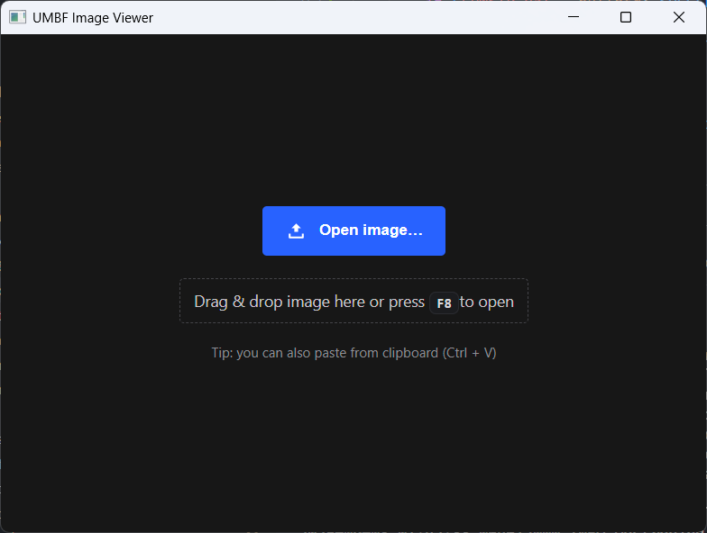
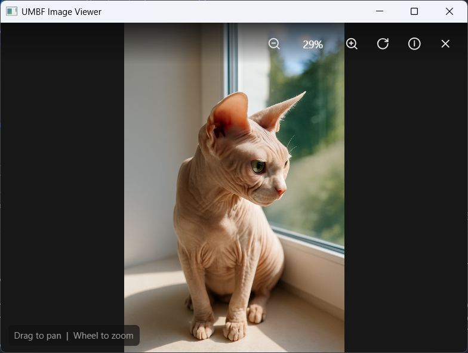

# UMBF Image Viewer

**umbf-viewer** is a lightweight application for viewing images stored in the **UMBF**.  
It is designed as a companion tool for the UMBF ecosystem, allowing quick inspection and visualization of images created or saved in this format.

## Features

- Open images in **umbf** format  
- Display image metadata 
- Basic navigation tools:
  - Zoom in / out  
  - Pan  
  - Fit to window  
- Cross-platform (Windows, Linux)

## Screenshots

  
Click to expand

  
  

## Building
### Supported compilers:
- GNU GCC
- Clang

### Supported OS:
- Linux
- Microsoft Windows

### Bundled submodules
The following dependencies are included as git submodules and must be checked out when cloning:

- [umbf](/app3d-public/umbf)
- [alwf](/app3d-public/alwf)

## License
This project is licensed under the [MIT License](LICENSE).

## Contacts
For any questions or feedback, you can reach out via [email](mailto:wusikijeronii@gmail.com) or open a new issue.